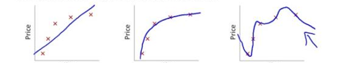
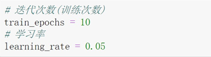
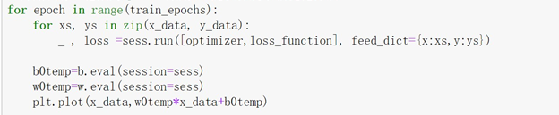
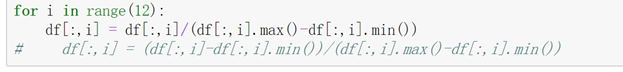

#                                                                                       机器学习2018-2019-2期中考核测试

###### 填空题

1. 最常用的两种监督学习任务是__**分类**__和_**回归**___。

2. 列举出四种常见的有监督式学的任务__**线性回归**__ , __逻辑回归__ , __神经网络__ 和__**SVM**__。

3. 垃圾邮箱检测的问题是监督学习还是无监督学习 _**监督学习**___。

4. 在梯度下降中，沿着负梯度方向进行下一步探索，前进距离为：__**学习率**__  这种参数属于 __超参数__。

5. L1正则化在原来损失函数的基础上加上_**求和 所有w的绝对值乘上lamda**__。

6. L2正则化在原来损失函数的基础上加上_**求和 所有w的平方乘上lamda**__。

7. 减少过拟合可以提升模型的__**泛化**__能力。

8. 请写出下面三个图片对应的拟合情况。

   

   

欠拟合 ，拟合，过拟合
------
                                   

###### 代码题

1. 使用numpy或者tensorflow编写一个sigmod函数（要求支持张量运算）。

python
import tensorflow as tf
import numpy as np

def sigmoid(x):
    ### 完善代码
    result = None
    
   **x = tf.pow(e,-z)
    
   **result = 1/1+x
    
   **return result

2. 使用numpy或者tensorflow编写一个函数计算单个样本数据的平均值，标准差，方差（要求支持张量运算）。

python
import tensorflow as tf
import numpy as np
def f(x):
    
    ### 完善代码
    
    
    ### 平均值
    mean = None
   **pred = tf.matmul(x,W)+b
   
   **mean =  tf.reduce_mean(pred)
    
    ### 标准差
    std = None
   **pred = tf.matmul(x,W)+b
    
   **std = forward =  tf.reduce_mean(tf.pow(y-pred,2))
    
    ### 方差
    var =None
    
  **pred = tf.matmul(x,W)+b
   
   **var = tf.reduce_mean(tf.sqrt(y-pred,2))**
   
    return mean,std,var

 

请解释一下迭代次数与学习率分别控制模型训练的什么？迭代次数与学习率的区别是什么？
**迭代次数表示要训练几轮，学习率指学习时下降的梯度

 

       

 请解释一下 ` _ , loss`  ，中的 `_` 代表着什么？为什么要在这里使用`_`  ？

**——，代表优化器，loss代表的误差，_没有值随意

 

请解释一下归一化操作的作用或者意义。
**归一化是当数据相差太大时使用，提高模型的泛化能力**
 

 

 

 当模型出现过拟合或者欠拟合时，应该采用什么方法来解决？

 **加正则**

 

 

 

在机器学习中 点乘法 与 叉乘有什么区别？
**点乘需要两个矩阵具有相同行列，然后对应相乘

**叉乘是第一个矩阵的列必须与第二矩阵的行相等，乘出来的矩阵具有第一个矩阵的行和第二个矩阵列

###### python题

1.以下哪个库是python的标准库？（**B）

- A.numpy      
- B.math    
- C.matplotlib   
- D.scrapy

2.列出所学过的机器学习库（from xxx import xxx, import xxx as xxx）

**1 import tensorflow as tf

**2 import numpy as np

**3 import matplotlib.pyplot as plt 

3.python内建数据类型有哪些(五种以上)？

**字典、元组、列表、布尔值、字符串

  

4.创建一个含有从1到9数字的3x3的二维数组，并输出

**import numpy as np

**x = np.arange(1,10).reshape(3,3)

**x 

5.python中l列表 和 元组的区别是什么

**例如 a ="nihao"

**变成列表输出是 'n','i','h','a','o'

**而元组是 nihao

###### 数学题

请使用jupyter notebook 完成下列矩阵运算（代码＋结果）

已知 请自己写出一个矩阵 matrix_a,matrix_b,并进行下面操作

1. 矩阵点乘 
**matrix_a= np.array([[1,2,3],
              [4,5,6]])

**matrix_b = np.array([[-1,-2,-3],
              [-4,-5,-6]])

**print(a_5 * b_5)

2. 矩阵叉乘 
**matrix_a = np.array([[1,2,3],
               [-1,-2,-3]])#2行3列

**matrix_b = np.array([[1,2,3,4],
               [2,1,2,0],
               [3,4,1,2]])#3行4列

**np.matmul(a_5,b_5)
3. 矩阵转置
**a=np.array[[1,2,3],[4,5,6]]

**print(matrix_a.T)

