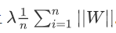
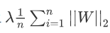

# 机器学习2018-2019-2期中考核测试

###### 填空题

1. 最常用的两种监督学习任务是___和____。
    > 回归、分类

2. 列举出四种常见的有监督式学习的任务____ , ____ , ____ 和____。
    > 线性回归、逻辑回归、感知机、支持向量机（SVM）、决策树、随机森林、K-近邻算法、朴素贝叶斯、提升树、EM算法、隐马尔可夫链、条件随机场等，还有基于提升树模型的改进算法XGBoost、lightgbm。


3. 垃圾邮箱检测的问题是监督学习还是无监督学习 ____。
    > 监督学习,垃圾邮件是一个二分类算法，可以简单的使用逻辑回归解决。

4. 在梯度下降中，沿着负梯度方向进行下一步探索，前进距离为：___  这种参数属于 ____。
    > 在最基础的梯度下降算法中，前进距离就是：`梯度*学习率`。但后面提出的动量算法、Adma、Admax等优化算法中，不仅仅是这个简单的使用`梯度*学习率`。这种参数属于`超参数`，超参数可以简单的理解为是需要`人为`去调整的参数。
5. L1正则化在原来损失函数的基础上加上___。
    > 
6. L2正则化在原来损失函数的基础上加上___。
    > 
7. 减少过拟合可以提升模型的____能力。
    > 泛化


8. 请写出下面三个图片对应的拟合情况。


**欠拟合、较好拟合、过拟合**


-----------------

###### 代码题

1. 使用numpy或者tensorflow编写一个sigmod函数（要求支持张量运算）。

```python
import tensorflow as tf
import numpy as np
# numpy 版
def sigmoid(x):
    ### 完善代码
    result = 1/(1 + np.exp(-x))

    return result
# tensorflow 版
def sigmoid(x):
    ### 完善代码
    result = 1/(1 + tf.exp(-x))

    return result


```

2. 使用numpy或者tensorflow编写一个函数计算单个样本数据的平均值，标准差，方差（要求支持张量运算）。

```python
import tensorflow as tf
import numpy as np

# numpy 版
def f(x):
    
    ### 完善代码
    
    ### 平均值
    mean = np.mean(x,axis=-1)
    
     ### 方差
    var = np.var(x,axis=-1)
    
    ### 标准差
    std = np.std(x,axis=-1)
    
    return mean,std,var

# tensorflow 版
def f(x):
    
    ### 完善代码
    
    ### 平均值
    mean = tf.reduce_mean(x,axis=-1)
    
     ### 方差
    var = tf.reduce_mean(tf.square(x - mean),axis=-1)
    
    ### 标准差
    std = tf.sqrt(var)
    
    return mean,std,var

```


 


请解释一下迭代次数与学习率分别控制模型训练的什么？迭代次数与学习率的区别是什么？
> 1. `迭代次数`：控制着模型训练的次数，即模型学习整个训练集的次数
> 2. `学习率`:控制着我们基于损失梯度调整神经网络权值的速度


请解释一下 ` _ , loss`  ，中的 `_` 代表着什么？为什么要在这里使用`_`  ？

> `_`等价于临时变量，也可以被称为垃圾回收站，不需要的东西都可以扔到`_`中。
> 在这里 `loss`获取的是`loss_function`被sess执行之后的值，而`_`获取的是`optimizer`被sess执行之后的值,这个值对我们来说是无用的，但是又不得不接收它。因此将它扔进`_`中。
“_”代表的是优化器，在这里使用是为了将“_”和loss的数据分开。


请解释一下归一化操作的作用或者意义。

> min-max 归一化:将数值范围缩放到（0,1）,但没有改变数据分布。为了将有量纲转化为无量纲，避免了不同数据之间单位差异带来的模型误差。其次将手机规范到（0,1）之间可以加快模型的收敛速度。
参考：https://zero.osai.club/ml/2018/06/03/%E6%BC%AB%E8%B0%88%E5%BD%92%E4%B8%80%E5%8C%96/
 

当模型出现过拟合或者欠拟合时，应该采用什么方法来解决？

> 过拟合：
> 1. 减少模型复杂度
> 2. 使用dropout
> 3. 使用BN
> 4. 正则化技术：L1、L2
> 5. 获取更多数据
> 
> 欠拟合：
> 1. 更大的模型
> 2. 更多的数据
> 3. 数据增强技术
> 4. 尝试更长时间的训练
> 5. 尝试一个新的模式架构


在机器学习中 点乘法 与 叉乘有什么区别？

比如两个3×3的矩阵，如果用点乘法则是每个元素对应相乘，而叉乘法则是前面矩阵的行去乘以后面矩阵的列得到的，还有矩阵中点乘法只能用到类型相同的矩阵，而叉乘满足的条件是前面的矩阵的列等于后面矩阵的行。

###### python题

1.以下哪个库是python的标准库？（B）

- A.numpy      
- B.math    
- C.matplotlib   
- D.scrapy

2.列出所学过的机器学习库（from xxx import xxx, import xxx as xxx）

- 1  numpy
- 2  tensorflow
- 3  pandas

3.python内建数据类型有哪些(五种以上)？

- 元组，列表，字典，字符串，布尔值,集合

  

4.创建一个含有从1到9数字的3x3的二维数组，并输出

'''
import numpy as np
print（np.arange(1,10).reshape(3,3)
   
   [[1 2 3]
 [4 5 6]
 [7 8 9]]
'''
5.python中l列表 和 元组的区别是什么

- Python元组和Python列表数据类似，都是线性表。唯一不同的是，Python元组赋值后所存储的数据不能被程序修改，可以将元组看作是只能读取数据不能修改数据的列表。因为元组类型和列表类型有很多相同之处，关于列表类型讲过的内容，不文不再重复讲述，重点讲述元组和列表的不同之处，然后讨论一下元组数据的不可修改特性。

------


###### 数学题

请使用jupyter notebook 完成下列矩阵运算（代码＋结果）

已知 请自己写出一个矩阵 matrix_a,matrix_b,并进行下面操作

1. 矩阵点乘
```python
import numpy as np
matrix_c = np.array([[3,1],[4,5],[2,4]])
matrix_d = np.array([[2,1],[1,2],[1,2]])
matrix_c * matrix_d

array([[ 6,  1],
       [ 4, 10],
       [ 2,  8]])
```


2. 矩阵叉乘 
```python
import numpy as np
matrix_c = [[3,1],[4,5],[2,4]]
matrix_d = [[2],[1]]
np.matmul(matrix_c,matrix_d)

array([[ 7],
       [13],
       [ 8]])
 ```

3. 矩阵转置
```python
  print(np.arange(1,10).reshape (3,3).T)
  
  [[1 4 7]
 [2 5 8]
 [3 6 9]]
 ```
